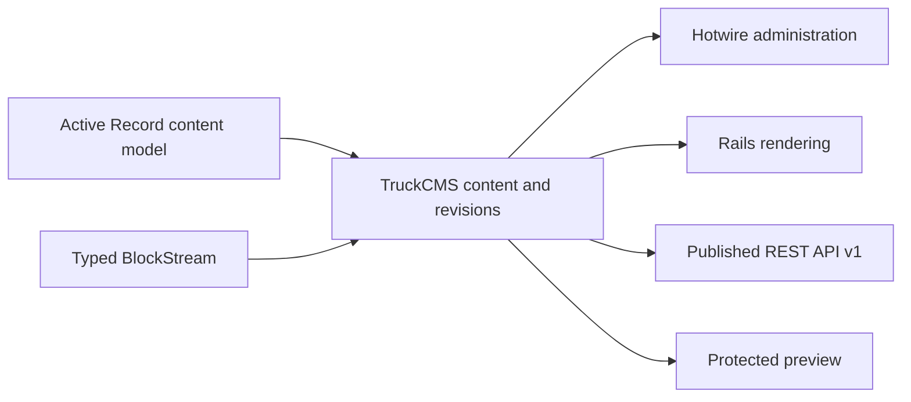

# TruckCMS v0.1 Product Requirements Document — V2

**Status:** Final lean baseline 
**Product:** TruckCMS 
**Release:** v0.1 
**Document version:** 2.0 
**Date:** 2026-08-21 
**Owner:** TruckCMS project 
**Supersedes for execution planning:** PRD v1 
**Decision history and market context:** [Product Concept](PRODUCT_CONCEPT.md) 
**Business diagrams:** [Business Model Canvas](diagrams/business-model-canvas.svg) · [Value Proposition Canvas](diagrams/value-proposition-canvas.svg)

V1 remains the comprehensive rationale and decision record. V2 is the shorter execution baseline. If a capability is absent from the V2 requirements, it is not v0.1 work.

## 1. Product Decision

TruckCMS v0.1 is a Rails-first, but not Rails-only, CMS for Rails developers launching a new content-driven website. It adds a professional editorial workflow to developer-defined Active Record models and delivers the same published revision through Rails views and a versioned REST API.

The v0.1 promise is:

> A Rails developer can start a new TruckCMS website where an administrator composes structured pages, previews drafts, publishes complete revisions, and delivers the same live content through Rails views and API v1.

TruckCMS is an isolated Rails engine with an official new-site starter. Supported installation into arbitrary existing Rails applications is the next product phase, not part of v0.1.

## 2. Problem and Users

Rails supplies persistence, validation, routing, views, authentication primitives, uploads, and frontend conventions. It does not supply an integrated structured-content editor, revision lifecycle, draft-safe preview, publishing workflow, or shared Rails/API publication contract.

Without TruckCMS, Rails teams must build those capabilities repeatedly or operate a separate CMS that weakens the connection to Rails models, routes, and views.

### Primary user

A Rails developer starting a new Rails 8.1+ website who needs editors to manage content without building a custom CMS and who may later serve React, Vue, mobile, or other API clients.

### Secondary user

A website administrator or editor who needs to compose structured content, understand its publication state, preview it safely, and publish it from a desktop or tablet.

## 3. One Product Model

Rails remains responsible for persistence, validation mechanisms, routing, controller/view execution, sessions, storage, and request security. TruckCMS adds content registration, block composition, revision and publication rules, editorial UI, preview authorization, and content serialization.

Rails rendering and API delivery must always resolve the same published revision.

## 4. v0.1 Release Boundary

### Included

- Official new-site starting path and isolated `TruckCMS` Rails engine.
- Rails 8.1 minimum, with later Rails versions supported only after certification.
- Developer-defined Active Record content models and a supplied `Page` model.
- Structured `BlockStream` content with heading, rich-text, image, and call-to-action blocks.
- Draft revisions, protected preview, immediate publish, and unpublish.
- Inspection-only revision history.
- Rails rendering at `/`, `/:slug`, and developer-owned prefixes such as `/posts/:slug`.
- Versioned, read-only published REST API and separately authorized preview delivery.
- Active Storage images.
- Hotwire administration styled with Tailwind CSS v4.
- Complete content editing at 768 CSS pixels and wider.
- SQLite, PostgreSQL, and MySQL/MariaDB compatibility.

### Not included

- Rails 8.0 or older.
- Supported installation into arbitrary existing Rails applications.
- Editor-defined schemas, nested page trees, or nested BlockStreams.
- Multiple editorial roles, approvals, scheduling, revision comparison, or restoration.
- Destructive content deletion; v0.1 uses unpublish.
- Multi-site, multi-tenancy, localization, search, redirects, or import/export.
- Full media-library administration.
- GraphQL or content write APIs.
- E-commerce or Shopify, Spree, and Solidus integration.
- Visual theme building, dark-mode administration, or real-time collaborative editing.
- Action Cable, background workflows, or caching work without a measured v0.1 need.

## 5. Requirements

Every requirement below is mandatory for v0.1. There is no “Should” tier.

### 5.1 Platform and access

- **REQ-01:** TruckCMS-owned controllers, models, jobs, helpers, routes, views, and assets use the `TruckCMS` namespace.
- **REQ-02:** The supported starter targets Rails 8.1 or a later version that passes the compatibility suite.
- **REQ-03:** The same release suite passes on SQLite, PostgreSQL, and MySQL/MariaDB without database-specific core behavior.
- **REQ-04:** Administration styles remain isolated from the public website, whose layout and theme stay under project control.
- **REQ-05:** Administrators can sign in and sign out using Rails authentication capabilities. v0.1 has one administrator capability level.
- **REQ-06:** Unauthenticated requests cannot access administration or draft previews.

### 5.2 Content models

- **REQ-07:** A developer can register an Active Record model as CMS-managed content without replacing Active Record persistence.
- **REQ-08:** Registration declares the display title, editable fields, API-visible fields, structured block fields, and routable slug when applicable.
- **REQ-09:** The supplied `Page` model uses the same public registration mechanism as project-defined models.
- **REQ-10:** Active Model validation errors appear beside the relevant field or block.
- **REQ-11:** Documentation demonstrates a second registered model, such as `Post`, using a fixed route prefix and no TruckCMS internals.

### 5.3 BlockStream

- **REQ-12:** A BlockStream is an ordered sequence of structured blocks; each stored block has a stable identifier, registered type, schema version, and validated data.
- **REQ-13:** v0.1 includes heading, rich-text, image, and call-to-action blocks.
- **REQ-14:** Editors can add, edit, remove, and reorder blocks. Reordering works without drag-and-drop for keyboard and touch users.
- **REQ-15:** Each block type defines its editor fields, validation, Rails renderer, and JSON representation.
- **REQ-16:** Image blocks use Active Storage and support alt text, caption, and an explicit decorative-image state.
- **REQ-17:** BlockStream does not support arbitrary nesting in v0.1.

### 5.4 Revisions and publication

- **REQ-18:** Saving creates an identifiable immutable revision snapshot.
- **REQ-19:** A content record distinguishes its latest draft from its currently published revision.
- **REQ-20:** Publishing selects one complete revision atomically. Unpublishing removes public Rails and API availability without deleting revisions.
- **REQ-21:** The editor clearly identifies draft, published, and published-with-unpublished-changes states.
- **REQ-22:** The editor exposes an inspection-only revision list with timestamp, actor, and publication state.
- **REQ-23:** Public delivery never changes until an administrator explicitly publishes another revision.

### 5.5 Routing and Rails rendering

- **REQ-24:** TruckCMS uses ordinary Rails routes and controllers; it does not replace the Rails router.
- **REQ-25:** `Page` supports `/` for one designated homepage and `/:slug` for top-level pages.
- **REQ-26:** A registered content type can use one developer-owned fixed prefix followed by one editor-owned slug, such as `/posts/:slug`.
- **REQ-27:** A slug is one URL segment, cannot contain `/`, and is unique within its route scope.
- **REQ-28:** Administration, API, authentication, health, and other reserved routes take precedence over content routes. Route conflicts fail clearly.
- **REQ-29:** Published content renders through Rails views, and every block renders through a replaceable partial or equivalent view boundary.
- **REQ-30:** Rails public rendering uses only the published revision unless an authorized preview selects a draft.

### 5.6 API and preview

- **REQ-31:** API v1 provides read-only list and detail delivery for published registered content.
- **REQ-32:** Published API responses contain the content type, stable public identifier, applicable slug or path, published revision identifier, publication timestamp, declared fields, and ordered typed blocks.
- **REQ-33:** The published API has the same public visibility as the corresponding published Rails page and never returns drafts or unpublished changes.
- **REQ-34:** Rails rendering and API delivery identify the same published revision.
- **REQ-35:** Draft preview uses a separate, revision-scoped, time-limited authorization grant and visibly indicates preview state.

### 5.7 Administration and media

- **REQ-36:** Administration has four primary surfaces: sign-in, content index, content editor, and preview.
- **REQ-37:** The content index is the administration home. Revision history is an editor drawer or panel; image selection remains inside the editor.
- **REQ-38:** Save, preview, and publish actions stay accessible; the editor distinguishes unsaved changes, validation failure, save success, and publication state.
- **REQ-39:** Administration uses Rails views, Hotwire, and Tailwind CSS v4 with a light theme and semantic design tokens.
- **REQ-40:** Shared UI components are extracted only after a pattern repeats; v0.1 does not build a general design system.
- **REQ-41:** Image upload validates allowed content types. v0.1 does not provide a standalone media library.
- **REQ-42:** The complete editor works at 768 × 1024 without page-level horizontal scrolling; controls work with touch and without hover.

### 5.8 Safety and quality

- **REQ-43:** Public routes and published APIs deny draft content by default.
- **REQ-44:** Administration mutations use authenticated sessions and Rails CSRF protection.
- **REQ-45:** Rich text is sanitized using a documented allowlist before public rendering.
- **REQ-46:** Controls have programmatic labels and visible focus; status is not conveyed by color alone; errors direct users to the failing field or block.
- **REQ-47:** API output is deterministic for a revision. Breaking response changes require a new API version.
- **REQ-48:** Block schema versions exist from the first release so stored content can be migrated later without inventing a migration UI now.

## 6. Administration Layout

| Surface | Minimum content |
|---|---|
| Sign-in | Product identity, email, password, submit, and clear failure feedback |
| Content index | Content type, title, path, publication state, updated time, state filter, create, and edit |
| Content editor | Fields, BlockStream, state, revision drawer, save, preview, publish, and unpublish |
| Preview | Actual public rendering, preview indicator, revision identity, and return-to-editor action |

On desktop, the editor uses a central block canvas with a compact status inspector. At tablet width, navigation and the inspector become drawers and the canvas becomes full-width. No separate dashboard is required.

## 7. Delivery Sequence

| Phase | Work | Exit condition |
|---|---|---|
| 1. Contracts | Close the decisions in Section 10 and approve desktop/tablet flows | Public behavior is defined before persistence or UI implementation |
| 2. Content domain | Registration, Page, BlockStream, validation, revisions, publication, slugs, and assets | The lifecycle works without the final administration UI |
| 3. Product surfaces | Authentication, four administration surfaces, Rails rendering, API v1, and preview | The complete publication journey works on desktop and tablet |
| 4. Hardening | Security, accessibility, route precedence, database matrix, documentation, and starter validation | Every launch gate passes |

## 8. Launch Acceptance

Every supported release-candidate environment must complete this journey without changing TruckCMS internals:

1. Start a new TruckCMS website and create the first administrator.
2. Sign in and create a `Page` with all four block types.
3. Save the draft and confirm it is absent from public Rails and API delivery.
4. Preview the exact draft through a protected preview.
5. Publish it and render the same revision through Rails and API v1.
6. Save another draft and confirm the published revision does not change.
7. Unpublish and confirm both public delivery surfaces stop serving it.
8. Register the documented second content model without modifying TruckCMS internals.

### Release gates

| Gate | Target |
|---|---|
| Draft exposure through ordinary public routes or API | Zero cases |
| Rails/API published revision parity | 100% of acceptance scenarios |
| Database suite | Pass on SQLite, PostgreSQL, and MySQL/MariaDB |
| Routes | `/`, `/:slug`, and fixed-prefix `/:slug` pass precedence, uniqueness, and collision tests |
| Tablet workflow | Complete at 768 × 1024 without horizontal overflow |
| Accessibility | Keyboard, touch, focus, labels, state, and error requirements pass the agreed Phase 1 conformance target |

## 9. Pilot Validation

After a usable prototype exists:

| Measure | v0.1 target |
|---|---|
| Rails developers who publish a first page without modifying TruckCMS internals | At least 80% |
| Rails developers who register a second model from documentation without maintainer help | At least 70% |
| Editors who complete create → draft → preview → publish without developer help | At least 80% |
| Editors who correctly identify all three publication states | At least 80% |
| Draft exposure | Zero cases |

Record the sample size, completion time, validation failures, and editor feedback. Do not add product features merely to improve an unmeasured concern.

## 10. Decisions Required in Phase 1

These are technical contracts, not additional product scope:

1. Public Ruby syntax for registering a content model and its fields.
2. Portable representation of revision snapshots and BlockStream data.
3. Rich-text representation. Start with Action Text; choose another approach only if a prototype cannot meet revision, sanitization, attachment, and API requirements.
4. Preview-grant lifetime, revocation, and Rails-native signing mechanism.
5. Reserved route prefixes and route-conflict detection.
6. Starter distribution form and first-administrator bootstrap.
7. Stable API identifier, pagination limit, and error shape.
8. Formal accessibility conformance target.
9. License and public package-name decision before public distribution.

## 11. Main Risks

| Risk | Required control |
|---|---|
| Scope expands toward Wagtail or Strapi completeness | Work absent from Section 5 waits for a later release |
| Block changes make stored content unreadable | Stable IDs and schema versions exist from v0.1 |
| Preview or API leaks drafts | Default-deny delivery and explicit leakage tests |
| Content routes shadow application routes | Explicit route ownership, precedence, and collision tests |
| Database differences break portability | Full release suite on all three database families |
| Tablet UI becomes a compressed desktop layout | Full critical-flow test at 768 × 1024 |

## 12. Change Rule

V2 is complete when the launch gates pass; it is not complete when every plausible CMS feature exists. Changing the primary user, product promise, included capabilities, or release gates requires PRD version 3. Implementation details may change without a PRD revision when they preserve every requirement above.
