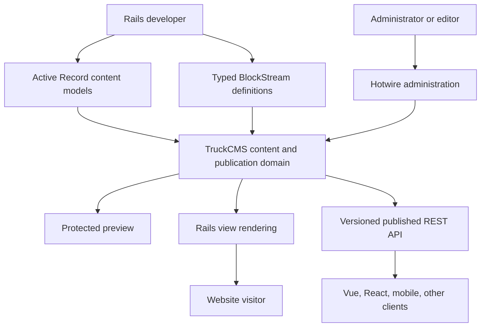
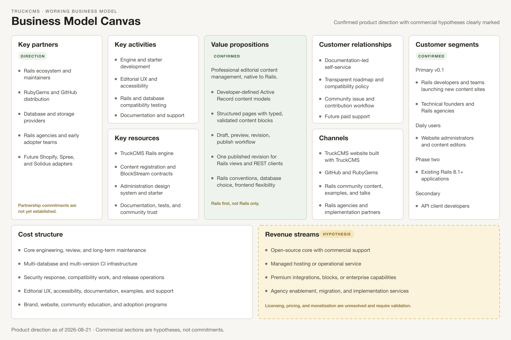
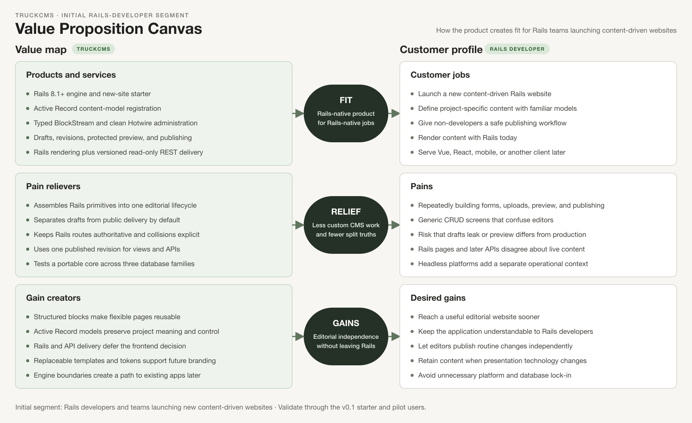

# TruckCMS Product Concept

**Status:** Working product and messaging foundation 
**Date:** 2026-08-21 
**Purpose:** Preserve the product reasoning behind TruckCMS and provide source material for the first TruckCMS-powered marketing website. 
**Related requirements:** [TruckCMS v0.1 PRD](PRD.md)

## 1. The Concept in One Sentence

**TruckCMS is professional editorial content management built for Rails—native to Rails models and views, ready for API delivery when the website needs it.**

## 2. Product Vision

TruckCMS should become the natural content-management layer for Rails teams that want to keep the strengths of Rails rather than placing a separate CMS beside it.

It begins as the foundation for a new Rails website. Developers define content with ordinary Active Record models and Rails conventions. Editors work in a purpose-built administration interface with structured blocks, drafts, preview, and publishing. Published content can be rendered directly with Rails views or delivered through a stable REST API to Vue, React, native mobile, or another frontend.

The long-term ambition is comparable in product completeness to strong editorial systems such as Wagtail while remaining recognizably Rails in architecture, operation, and developer experience. It is not intended to become an e-commerce platform. Commerce products can be referenced through external adapters later without placing carts, inventory, orders, payments, or checkout inside the CMS core.

## 3. Why TruckCMS Should Exist

Rails is excellent at building database-backed web applications, but a framework is not an editorial product. Rails gives developers the pieces; it does not give editors a complete content lifecycle.

When a Rails team needs a serious content website, it still has to decide and implement:

- How a model becomes editable content.
- How fields become an understandable editor form.
- How flexible landing pages are composed without hard-coded layouts.
- How drafts differ from published content.
- How preview remains private.
- How revisions are identified and eventually restored.
- How editor-managed slugs coexist with developer-managed Rails routes.
- How Rails pages and external clients receive the same publication state.
- How administration remains usable without becoming a bespoke application project.

TruckCMS exists to turn those repeated decisions into a coherent Rails-native product.

## 4. Market Wedge

### 4.1 Initial market segment

The first market is not “everyone who needs a CMS.” It is:

> Rails developers and small-to-medium product teams launching a new content-driven website on Rails 8.1 or a later certified version, who want professional editorial management now and optional API delivery later.

Typical projects may include:

- Corporate and organization websites.
- Editorial publications and blogs.
- Documentation or knowledge websites.
- Product marketing websites.
- Community and membership content sites.
- Content sections inside a larger Rails product.

The last category becomes a supported installation target after the new-site experience is stable.

### 4.2 Primary buyer and adopter

The primary adopter is a Rails developer, technical founder, agency, or Rails product team. This person chooses the architecture, evaluates the gem or starter, defines content models, and maintains the application.

### 4.3 Daily user

The daily administration user is a website administrator or content editor. This user may not know Rails and should not have to understand database columns, controllers, or serialization to create and publish a page.

### 4.4 Secondary technical user

An API consumer builds a Vue, React, native mobile, or other frontend that reads TruckCMS content. This user benefits from the product but does not drive the v0.1 administration architecture.

### 4.5 Phase-two segment

After the new-site workflow is reliable, TruckCMS will target teams adding professional editorial content management to an existing Rails 8.1+ application. Engine isolation and explicit integration boundaries are being preserved now so this expansion does not require redesigning the core.

## 5. The Problem We Solve

### 5.1 Functional problem

Rails teams can build content features, but they lack one modern, integrated default for structured page composition, drafts, revisions, preview, publishing, Rails rendering, and API delivery.

### 5.2 Workflow problem

Developers repeatedly assemble authentication, forms, uploads, route rules, revision gems, state transitions, previews, serializers, and administration styles. The result is often application-specific and expensive to improve.

Editors receive CRUD screens instead of a workspace designed around editorial decisions. Publication state may be unclear, preview may not match the real site, and flexible pages may depend on developer intervention.

### 5.3 Architectural problem

A headless-only CMS can solve content storage while creating a different separation problem: the Rails website becomes just another API client, even when server-rendered Rails views are the simplest and most natural delivery method.

Conversely, a Rails-only page system can make a future mobile or JavaScript frontend difficult because there is no stable delivery contract.

### 5.4 Trust problem

Editors and developers must trust that:

- Drafts cannot leak into public delivery.
- Preview shows the intended revision.
- Publishing changes the entire content snapshot, not part of it.
- Rails pages and API clients agree about what is live.
- A framework or database update does not silently corrupt structured content.

TruckCMS makes these trust boundaries part of the product rather than leaving them to each website.

## 6. Value Proposition

### 6.1 Core value proposition

> Launch a Rails content website with a real editorial workflow, keep full Rails control, and deliver the same published content to any frontend.

### 6.2 Benefits for Rails developers

- **Less undifferentiated work:** Start with content registration, blocks, drafts, preview, publishing, media, and delivery contracts already defined.
- **Rails-native mental model:** Continue using Active Record, Active Model validation, Rails routes, views, controllers, Active Storage, and Hotwire.
- **No forced frontend decision:** Render with Rails now; add Vue, React, mobile, or another API client later.
- **Clear ownership boundaries:** The CMS owns editorial lifecycle; Rails remains the application framework.
- **Database choice:** Use SQLite, PostgreSQL, or MySQL/MariaDB within the tested portable core.
- **Extensible content:** Define project-specific models and blocks without editing TruckCMS internals.
- **Safer evolution:** Versioned block data and delivery APIs create explicit upgrade boundaries.

### 6.3 Benefits for editors

- **Structured flexibility:** Compose a page from meaningful blocks rather than an unrestricted HTML field.
- **Visible state:** Understand whether content is draft, published, or contains unpublished changes.
- **Safe preview:** Review the actual website rendering before publication.
- **Confident publishing:** Publish a complete revision and know what visitors will receive.
- **Focused workspace:** Work in a clean administration interface rather than a generic database scaffold.
- **Tablet access:** Complete the editing workflow on a tablet when away from a desktop.

### 6.4 Benefits for organizations

- **Faster path to editorial independence:** Editors can manage routine content without developer deployment work.
- **Reduced custom-CMS maintenance:** Common editorial infrastructure is maintained as a product.
- **Frontend flexibility:** Content investment survives a later change in presentation technology.
- **Operational coherence:** The CMS runs with the Rails application and can use Rails-supported infrastructure.
- **Lower platform fragmentation:** One domain model supports both the website and external delivery.

## 7. What Makes TruckCMS Different

### 7.1 Rails first, not Rails only

TruckCMS does not treat Rails as merely a backend API framework. Rails rendering is first-class, and API delivery is equally deliberate.

### 7.2 Active Record models are the content models

Developers define meaningful project models. TruckCMS adds editorial metadata and behavior rather than placing all content into an opaque universal entry table or requiring an editor-managed schema builder in the first release.

### 7.3 One published revision across every delivery surface

The Rails view and REST API must identify the same published revision. This is a product invariant, not an implementation preference.

### 7.4 Structured blocks with Rails rendering

TruckCMS adopts the strongest idea from block-stream competitors: an ordered sequence of typed, validated, reusable blocks stored as structure rather than only rendered HTML. Each block has a Rails rendering boundary and an API representation.

### 7.5 Rails mechanisms remain visible

TruckCMS uses Rails routing rather than replacing it, Active Storage rather than inventing a file backend, Active Model validations rather than a competing error system, and Hotwire rather than requiring a separate administration SPA.

### 7.6 A narrow first release

The first release proves the whole workflow instead of advertising a large collection of incomplete features. Advanced workflow, page trees, localization, search, commerce adapters, and existing-application installation follow only after the core is trustworthy.

## 8. Product Shape

The domain is the center. Administration, Rails rendering, preview, and API delivery are surfaces over the same revision and publication rules.

## 9. The First Complete Product Story

TruckCMS v0.1 succeeds when this story is real:

1. A Rails developer starts a new TruckCMS-powered website.
2. The project contains a supplied Page model implemented through the public content-registration mechanism.
3. An administrator signs in.
4. The administrator creates a page with a title and slug.
5. The administrator composes the page from heading, rich-text, image, and call-to-action blocks.
6. The administrator saves a draft and previews the actual website rendering.
7. The administrator publishes one complete revision.
8. A visitor reads the page through a normal Rails route.
9. An API client retrieves the same published revision as structured JSON.
10. Unpublished changes remain private until a later publication.

Everything in v0.1 should strengthen this story. Features that do not are candidates for a later phase.

## 10. Route and Collection Concept

TruckCMS keeps developer-controlled structure and editor-controlled identity separate:

- `/` is the designated homepage.
- `/:slug` serves general top-level pages such as `/about`.
- A developer-controlled fixed prefix plus one editor-controlled slug serves collections such as `/posts/hello-world` or `/news/product-launch`.
- A slug represents one segment and never contains `/`.

These are ordinary Rails routes. TruckCMS resolves the published content after Rails dispatches the request. Editor-created directory trees and arbitrarily nested paths are deliberately deferred because they introduce hierarchy, move, redirect, breadcrumb, and collision behavior beyond the first release.

## 11. Structured Content Concept

The working name for the flexible field is **BlockStream**.

A BlockStream is an ordered sequence of blocks. Every block contains:

- A stable block identifier.
- A registered block type.
- A schema version.
- Structured validated data.

The first block set is intentionally small:

- Heading.
- Rich text.
- Image with alt text, caption, and decorative intent.
- Call to action with label and URL.

Developers will later be able to define project-specific blocks such as testimonials, people, statistics, related content, product references, maps, galleries, or code examples. Reusable blocks, arbitrary nesting, and complex custom widgets are not required to prove v0.1.

## 12. Administration Experience Concept

### 12.1 Design character

The administration should feel calm, precise, and editorial:

- Warm white canvas and charcoal typography.
- Thin structural borders.
- Minimal shadows and decoration.
- Color reserved for state, warnings, errors, and preview.
- Comfortable whitespace without oversized marketing-style layouts.
- Clear labels and visible keyboard focus.
- A light theme in v0.1, with semantic design tokens that allow future branding or dark mode.

### 12.2 Four primary surfaces

1. **Sign-in** — focused access to the protected administration.
2. **Content index** — the administration home and record list.
3. **Content editor** — fields, blocks, status, revisions, save, preview, and publish.
4. **Preview** — the actual site rendering with an unmistakable preview indicator.

Revision history is an editor drawer. Image selection is an editor modal. Neither requires a separate primary screen in v0.1.

### 12.3 Tablet principle

At 768 CSS pixels, the editor remains a real editor rather than a squeezed desktop interface. Navigation and metadata move into drawers, the block canvas becomes full-width, primary actions remain visible, and block movement supports touch and explicit move controls.

## 13. Rails Capabilities and TruckCMS Responsibilities

| Rails capability | TruckCMS use | TruckCMS-specific addition |
|---|---|---|
| Active Record | Content persistence and associations | Content-model registration and revision snapshots |
| Active Model | Validation and errors | Editorial field/block metadata and publication validation |
| Rails router | Request dispatch and URL helpers | Slug ownership, route-prefix contracts, and published-content resolution |
| Rails authentication | Administrator identity and sessions | CMS access boundary; advanced roles later |
| Action View | Public and administration rendering | Per-block renderers and replaceable public templates |
| Hotwire | Responsive Rails-native administration | Block editing, drawers, dialogs, and publication feedback |
| Active Storage | Uploads, blobs, and variants | Accessible asset metadata and block usage |
| Action Text | Rich-text capability where it fits | A revision-safe rich-text contract still to be resolved |
| Active Job/Solid Queue | Background execution | Scheduled publishing, webhooks, and media work later |
| Cache and Action Cable | Delivery caching and real-time behavior | Optional later optimizations, not core v0.1 requirements |

## 14. Competitive Inspiration and Boundaries

### 14.1 Wagtail

TruckCMS is inspired by Wagtail's combination of developer-defined models, an editor-focused administration, and structured StreamField content. TruckCMS should learn from those product concepts while using Rails conventions, Ruby APIs, Rails views, Active Storage, and Rails routing rather than duplicating Django internals or Wagtail's interface.

### 14.2 Headless CMS products

Products such as ButterCMS and Strapi demonstrate the importance of stable content APIs and frontend independence. TruckCMS adopts that delivery benefit without making Rails views a second-class integration.

### 14.3 Rails commerce platforms

Shopify APIs, Spree, and Solidus may become external content-reference adapters. TruckCMS will not duplicate commerce domains. A future product block can reference an external product while pricing, inventory, cart, order, and payment behavior remains with the commerce system.

## 15. Business Model Canvas

The current business model is partly a hypothesis because licensing, pricing, and monetization have not yet been decided. The canvas distinguishes the confirmed market and value direction from commercial options that require validation.

Editable vector: [business-model-canvas.svg](diagrams/business-model-canvas.svg) 
Wide preview: [business-model-canvas.png](diagrams/business-model-canvas.png)

## 16. Value Proposition Canvas

The value proposition canvas connects the initial Rails-developer segment to the capabilities and outcomes TruckCMS is designed to produce.

Editable vector: [value-proposition-canvas.svg](diagrams/value-proposition-canvas.svg) 
Wide preview: [value-proposition-canvas.png](diagrams/value-proposition-canvas.png)

## 17. Business Model Hypotheses

The product discussion has established a target segment and value proposition, but not a commercial model. These options must not be presented publicly as commitments:

- Open-source core with paid support.
- Managed TruckCMS hosting.
- Paid premium blocks or integrations.
- Agency or enterprise support subscriptions.
- Commercial migration and implementation services.

Licensing is a foundational open decision because it affects community adoption, contribution, distribution, trademark strategy, and potential revenue streams.

## 18. Marketing Message Foundation

### 18.1 Primary message

**Professional editorial content management, native to Rails.**

### 18.2 Supporting message

Define content with Active Record. Edit it through a clean structured workflow. Render it with Rails or deliver it through a versioned API.

### 18.3 Benefit-led message options

- Build the website in Rails. Give editors the CMS they expect.
- One published revision for Rails views and every API client.
- Structured page building without leaving the Rails ecosystem.
- Start server-rendered. Add any frontend when you need it.
- Your models, your routes, your views—now with a real editorial workflow.

These are messaging directions, not final taglines. Claims about speed, adoption, reliability, or cost should not be published until evidence exists.

### 18.4 Proof points the product must earn

- A new project reaches its first published structured page through the supported starter.
- Page is not a privileged internal special case; it uses the public content registration mechanism.
- Rails rendering and API delivery expose the same published revision.
- Draft content stays out of public routes and published APIs.
- The full editor works on a 768 × 1024 tablet viewport.
- The release suite passes on SQLite, PostgreSQL, and MySQL/MariaDB.
- A developer can define a second content model using documentation rather than modifying TruckCMS internals.

## 19. First TruckCMS Website Content Pillars

The first marketing website will itself be a TruckCMS proof point. Its content can be organized around these pillars:

### 19.1 Why TruckCMS

Explain the gap between Rails framework capabilities and a complete editorial product. Show why Rails-first does not have to mean Rails-only.

### 19.2 Developer experience

Show the conceptual journey from Active Record content model to editor form, preview, Rails route, and API response. Avoid publishing unstable installation syntax before it is finalized.

### 19.3 Editorial experience

Show clean content listing, BlockStream composition, visible publication state, and real-site preview on desktop and tablet.

### 19.4 Structured content

Explain why typed blocks are more reusable and API-friendly than a single HTML field, and why developers—not editors—define the allowed structure in v0.1.

### 19.5 Rails integration

Explain which Rails capabilities TruckCMS uses and which CMS responsibilities it adds. This is a central differentiation story.

### 19.6 Open roadmap

Present v0.1 honestly: new sites first, then existing Rails applications, then advanced editorial capabilities and optional integrations.

## 20. Discussion and Decision History

This section preserves the reasoning that produced the current concept.

### 20.1 Original vision

The initial idea was a general-purpose CMS built from the latest supported Ruby on Rails version and usable with Rails-supported databases. The desired product could approach the completeness of Wagtail or the headless flexibility of ButterCMS and Strapi. It should use Rails strengths such as authentication, views, Hotwire, Action Cable, Active Storage, and related framework capabilities, while also supporting mobile and JavaScript clients through an API.

E-commerce was explicitly not an initial goal, although future compatibility with existing commerce systems such as Shopify, Spree, or another Rails commerce platform was considered desirable.

### 20.2 Direction decision: hybrid Rails-native CMS

The product direction became **Rails first, not Rails only**. TruckCMS will have one content and publication domain with a Rails/Hotwire administrator, direct Rails rendering, and API delivery. Vue, React, and mobile support means they can reliably consume the API; it does not mean maintaining parallel administration applications.

### 20.3 Initial audience decision

The initial audience was defined as Rails developers who need professional editorial content management while retaining API delivery. This replaced the unbounded goal of serving every possible CMS user.

### 20.4 Packaging decision

The product will use its own `TruckCMS` namespace and an isolated Rails-engine architecture. A gem can supply the engine, but a complete new site also needs an application shell and supported starter path. The exact starter distribution mechanism remains open.

### 20.5 Content-model decision

Content models will be developer-defined Active Record models with TruckCMS metadata and behavior. TruckCMS will derive administration, validation presentation, revisions, draft/publish behavior, API serialization, preview, and routing metadata from a public registration contract.

The supplied Page model must use this same contract so the extensibility mechanism is exercised by the product itself.

### 20.6 Rails integration decision

TruckCMS will exploit Rails capabilities instead of replacing them. Rails remains responsible for routing, validation mechanisms, persistence, rendering, storage, authentication primitives, jobs, and related framework behavior. TruckCMS supplies editorial lifecycle and user experience.

### 20.7 Structured-block decision

A Wagtail-inspired structured block stream was identified as a notable differentiator and a desired feature for flexible landing pages. The TruckCMS concept uses ordered typed blocks with validation, rendering, and API representation. v0.1 limits the block set and nesting to keep the release complete.

### 20.8 API decision

The API is a main delivery capability, not an afterthought. v0.1 will provide a minimal versioned read-only published API and a separately authorized preview path. Rails-rendered pages and the API must use the same published revision.

### 20.9 Commerce boundary decision

Commerce remains outside the CMS core. Future external-reference blocks and integration packages may connect content to Shopify, Spree, or Solidus without importing commerce behavior into TruckCMS.

### 20.10 Release-target revision

The initial thought of embedding into existing Rails applications was moved to the second product phase. v0.1 will target new websites first to reduce integration variables and establish a clean default. Engine isolation is retained so existing-application support remains a credible next step.

### 20.11 Version-support decision

Rails 8.0 and older versions will not be supported. Rails 8.1 is the minimum. “Or newer” means newer Rails releases become supported after certification, not that TruckCMS promises compatibility with all future Rails versions automatically.

### 20.12 Routing decision

Rails routing and CMS slugs were separated conceptually. Rails maps requests to controllers; TruckCMS associates editor-controlled slugs with published records. v0.1 supports `/`, `/:slug`, and developer-controlled fixed prefixes such as `/posts/:slug`. Nested editor-created page trees are deferred.

### 20.13 Administration-surface decision

The minimum administrator product was reduced to four primary surfaces: sign-in, content index, content editor, and preview. Revision history is an editor drawer, and image selection is an editor modal.

### 20.14 UI and tablet decision

The administrator will use a clean, easily replaceable Tailwind CSS v4 design with semantic tokens and reusable components. It will ship with a light theme. The full content editor must work at 768 CSS pixels and wider; tablet navigation and metadata become drawers instead of squeezing the editing canvas.

### 20.15 Delivery-phase decision

v0.1 will be delivered through four internal phases:

1. Product and technical contracts.
2. Core content domain.
3. Editorial and delivery surfaces.
4. Release hardening.

## 21. Confirmed Decisions

- Rails first, not Rails only.
- Rails developers launching a new website are the v0.1 primary segment.
- Existing Rails application installation is the next product phase.
- Isolated `TruckCMS` engine architecture.
- Rails 8.1 minimum and no backward-version support.
- Developer-defined Active Record content models.
- Structured BlockStream content.
- Draft, preview, revision, publish, Rails rendering, and REST delivery as the core story.
- Rails routes remain authoritative.
- `/`, `/:slug`, and fixed-prefix `/:slug` routing in v0.1.
- Minimal versioned read-only API with separate preview authorization.
- E-commerce outside the core.
- Four primary administrator surfaces.
- Tailwind CSS v4, light theme, semantic tokens, and replaceable components.
- Tablet content editing supported from 768 CSS pixels.
- SQLite, PostgreSQL, and MySQL/MariaDB portable core.

## 22. Open Strategic Questions

- What license will govern the core?
- Is the long-term product primarily open-source software, a commercial product, a hosted service, or a combination?
- Which distribution path becomes the primary new-site starter?
- What brand, domain, and trademark position is available for TruckCMS?
- Which Rails communities, agencies, and early adopters should validate the first release?
- Which product metric will become the primary post-launch indicator after prototype baselines exist?
- When does existing-application installation become ready enough to replace the new-site-only positioning?

## 23. Current Product Promise

The product promise for v0.1 should remain concrete and defensible:

> With TruckCMS, a Rails developer can launch a new Rails website where an administrator composes structured pages, previews drafts, publishes complete revisions, and delivers the same live content through Rails views and a versioned API.

That promise is the foundation for product work, documentation, and the first TruckCMS marketing website.
